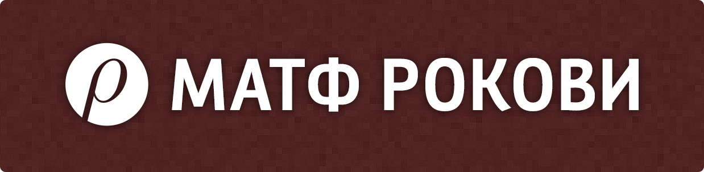

Ovo je kôd sajta [MATF Rokovi](https://rokovi.ubavic.rs/). Sajt je napisan u PHP jeziku uz pomoć [CodeIgniter](https://github.com/codeigniter4/CodeIgniter4) framework-a.

Svaka pomoć u razvoju softvera je dobrodošla.

## Instalacija

Za pokretanje ovog softvera potreban je server sa PHP jezikom verzije barem 7.2 i MySQL bazom verzije barem 5.1.

Sledeće PHP ekstenzije moraju biti instalirane/omogućene `intl`, `mbstring`, `php-json`, `php-mysqlnd`, `php-xml` i `php-curl`.

Prilikom instalacije potrebno je kreirati jednu bazu, a zatim pomoću skripte `create_db.sql`, kreirati tabele unutar ove baze. Zatim je potrebno podesiti odgovarajuće parametre (ime baze, kredencijale) unutar fajla `.env` koji se kreira kopiranjem fajla `env`.

Server za razvoj aplikacije pokrenite komandom `php spark serve` unutar foldera repozitorijuma. Za instalaciju na ostalim serverima, pročitajte [dokumentaciju](https://codeigniter.com/user_guide/installation/index.html).
